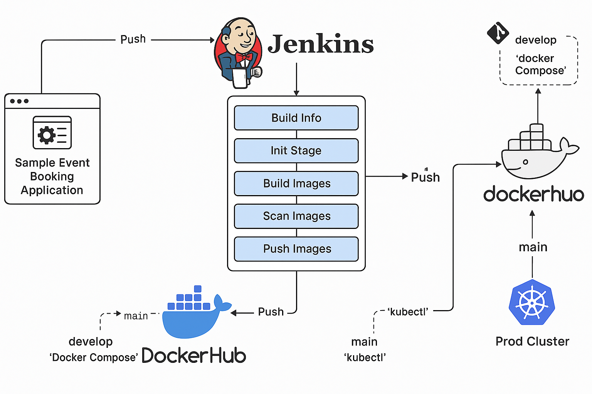

# 🎫 Evently – Cloud-Powered Event Booking App

**Evently** is a full-stack event booking application designed with modern UI/UX, built for speed, simplicity, and automation. It enables users to explore upcoming events, book seats, and manage their participation entirely through a beautiful frontend, while a secure Flask backend handles all the logic.

---

## 🚀 Live Features

* ✅ Dynamic listing of upcoming events
* ✅ Real-time seat availability updates
* ✅ User-friendly booking modal with form validation
* ✅ Admin panel for adding new events
* ✅ Responsive and mobile-first design
* ✅ RESTful API integration (Flask backend)
* ✅ Frontend-backend decoupling with API calls
* ✅ CI/CD-ready architecture

---

## 🧱 Tech Stack

| Layer     | Tech Used                                 |
| --------- | ----------------------------------------- |
| Frontend  | HTML, TailwindCSS, JavaScript             |
| Backend   | Python, Flask, Flask-CORS, SQLAlchemy     |
| Database  | SQLite (Local), upgradeable to PostgreSQL |
| Dev Tools | Git, Postman, VSCode, Curl                |
| Future    | Docker, Jenkins CI/CD, Kubernetes         |

---

## 🏗️ CI/CD Architecture




---

## 📂 Project Structure

```
evently/
├── evently-backend/
│   ├── app/
│   ├── instance/           # SQLite DB
│   ├── config.py
│   ├── run.py
│   └── requirements.txt
├── evently-frontend/
│   ├── index.html
│   ├── assets/
│   ├── style.css
│   └── ...
└── README.md
```

---

## 💠 How to Run the Project Locally

### Backend (Flask API)

```bash
cd evently-backend
python3 -m venv venv
source venv/bin/activate
pip install -r requirements.txt
python run.py
```

> App will run at: `http://127.0.0.1:5000`

---

### Frontend (Static HTML + JS)

```bash
cd evently-frontend
python3 -m http.server 9090
```

> Open `http://localhost:9090` in your browser

---

## 🔐 Environment Variables

| File        | Variable      | Description        |
| ----------- | ------------- | ------------------ |
| `.env`      | SECRET\_KEY   | Flask security key |
| `config.py` | DATABASE\_URL | Path to SQLite DB  |

---

## 🧠 API Endpoints

| Method | Endpoint                 | Description        |
| ------ | ------------------------ | ------------------ |
| GET    | `/api/events`            | List all events    |
| POST   | `/api/events`            | Create a new event |
| POST   | `/api/book/<event_id>`   | Book a seat        |
| POST   | `/api/cancel/<event_id>` | Cancel a booking   |

---

## 📄 License

This project is licensed under the MIT License. Feel free to use, modify, and distribute with credit.

---

